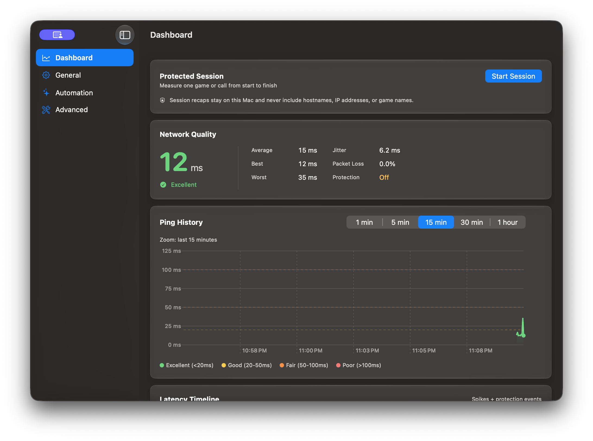

<p align="center">
  
</p>

<h1 align="center">Ping Warden</h1>

<p align="center">
  <strong>Stop AWDL from reactivating during latency-sensitive games and calls.</strong>
</p>

<p align="center">
  <code>event-driven protection</code> &bull;
  <code>macOS 13+</code> &bull;
  <code>Intel and Apple silicon</code> &bull;
  <code>signed and notarized</code>
</p>

<p align="center">
  <a href="https://github.com/oliverames/ping-warden/releases/latest"></a>
  <a href="LICENSE"></a>
  <a href="https://www.buymeacoffee.com/oliverames"></a>
</p>

<p align="center">
  <a href="#install-approve-and-verify">Install</a> &bull;
  <a href="#how-it-works">How it works</a> &bull;
  <a href="#privacy">Privacy</a> &bull;
  <a href="#documentation">Documentation</a> &bull;
  <a href="#build-from-source">Build</a>
</p>

---

Ping Warden is a free, open source macOS menu bar app for latency-sensitive games, calls, and cloud streaming. It watches Apple Wireless Direct Link (AWDL), the network interface used by AirDrop, AirPlay, Handoff, and other nearby-device features, and keeps that interface down while Ping Protection is active.

<p align="center">
  
</p>

## The tradeoff

Ping Protection temporarily makes AirDrop, AirPlay, Handoff, and other AWDL-dependent features unavailable on your Mac. Turn protection off when you need them, or use the 10-minute pause from the menu bar. Ping Warden restores AWDL when protection stops and during its removal flow.

That tradeoff is the point of the app. You choose when a latency-sensitive game or call matters more than nearby-device features.

## Why this exists

Running `sudo ifconfig awdl0 down` once is not enough because macOS can bring AWDL back up within seconds. A timer-based script reacts after the interface is already active, which still leaves time for channel switching to affect the connection.

## How it works

Ping Warden uses a privileged helper that waits for kernel route and interface events. When macOS tries to raise `awdl0` while Ping Protection is on, the helper takes it back down and increments an intervention counter. The dashboard puts that counter next to live latency, jitter, probe failures, and history so you can see what happened on your own network.

## Install, approve, and verify

### 1. Install

Download the latest DMG from [Releases](https://github.com/oliverames/ping-warden/releases/latest), open it, and drag Ping Warden to `/Applications`. Launch the copy in Applications.

### 2. Approve the helper

Click **Set Up and Turn On Protection**, then approve Ping Warden in System Settings when macOS asks. The helper needs this one-time approval because changing the AWDL interface requires elevated access.

### 3. Turn on Ping Protection and verify it

Enable **Ping Protection** from the menu bar. Open the dashboard and confirm that protection is active. The dashboard will show live latency and count each time the helper blocks macOS from reactivating AWDL.

The [Quick Start guide](PingWarden/QUICKSTART.md) covers first-run setup and the optional automation features.

## What Ping Warden includes

| Feature | What it does |
|---------|--------------|
| Ping Protection | Keeps `awdl0` down with an event-driven privileged helper |
| Live dashboard | Tracks latency, jitter, probe failures, history, and helper interventions |
| Game Mode auto-detect | Turns protection on for recognized fullscreen games after you grant Screen Recording access |
| Quick pause | Restores nearby-device features for 10 minutes, then returns to your previous protection state |
| Control Center widget | Provides a system toggle on macOS 26 or newer in signed release builds |
| Diagnostics export | Creates a local support snapshot that you can review before sharing |
| Automatic updates | Uses Sparkle and signed update metadata to deliver new releases |

Apple added third-party Mac controls to Control Center in [macOS Tahoe 26](https://developer.apple.com/videos/play/wwdc2025/278/?time=536), which is why the widget has a newer requirement than the rest of the app.

Ping targets include common public services, discovered GeForce NOW regions, your network gateway, and targets you add yourself.

## Privacy

Latency history, protection state, settings, and intervention counts stay on your Mac. Ping Warden does not send usage analytics.

The app makes a few narrow outbound requests:

- Sparkle checks the public appcast for updates.
- The dashboard checks `status.geforcenow.com` to discover GeForce NOW target hostnames.
- Anonymous crash reporting is off by default. If you opt in under **Settings > Advanced > Privacy**, reports exclude IP addresses, ping targets, network breadcrumbs, performance traces, and app-lifecycle tracking.
- TCP latency probes connect only to the target you select or ask Ping Warden to choose.

Diagnostics exports are written locally. Ping Warden never uploads them for you.

## Donate to Ping Warden

The dashboard tells you how often Ping Warden had to step in. If you have found the app useful, you can [donate on Buy Me a Coffee](https://www.buymeacoffee.com/oliverames) to help cover signing, testing, and release costs.

Ping Warden remains free and open source whether you donate or not.

## Documentation

- [Quick Start](PingWarden/QUICKSTART.md) covers installation and first-run setup.
- [Full documentation](PingWarden/README.md) explains the architecture, settings, and operating model.
- [Troubleshooting](PingWarden/TROUBLESHOOTING.md) provides safe recovery steps and diagnostic commands.
- [Release notes](RELEASE_NOTES.md) record changes by version.
- [GitHub Issues](https://github.com/oliverames/ping-warden/issues) is the place to report a reproducible problem or request a feature.

## Build from source

```bash
git clone https://github.com/oliverames/ping-warden.git
cd ping-warden
swift test
open PingWarden/PingWarden.xcodeproj
```

The app requires macOS 13 or newer. Configure signing for the app, helper, and widget targets before running from Xcode. The full helper-registration flow only works when the built app is installed in `/Applications`; non-helper UI work can run from Xcode.

## Credits

- [jamestut/awdlkiller](https://github.com/jamestut/awdlkiller) provided inspiration for Ping Warden's approach to AWDL control.
- [james-howard/AWDLControl](https://github.com/james-howard/AWDLControl) provided a reference for the SMAppService and XPC architecture.

## License

Ping Warden is available under the MIT License. Copyright (c) 2025-2026 Oliver Ames.

---

<p align="center">
  <a href="https://www.buymeacoffee.com/oliverames">
    
  </a>
</p>

<p align="center">
  <sub>
    Built by Oliver Ames in Vermont
    &bull; <a href="https://github.com/oliverames">GitHub</a>
    &bull; <a href="https://linkedin.com/in/oliverames">LinkedIn</a>
    &bull; <a href="https://bsky.app/profile/oliverames.bsky.social">Bluesky</a>
  </sub>
</p>
